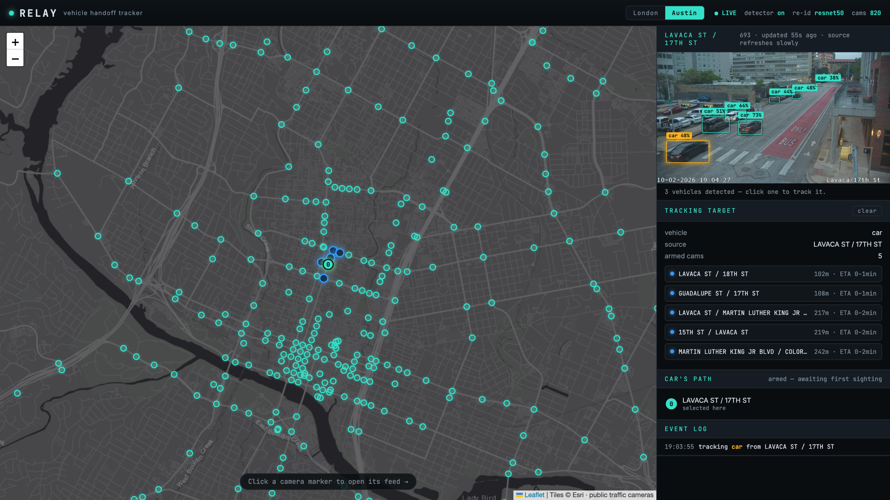
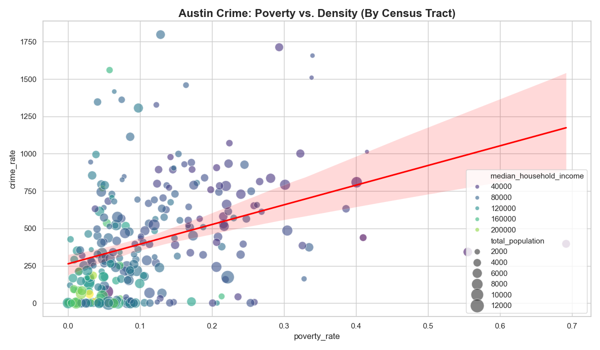
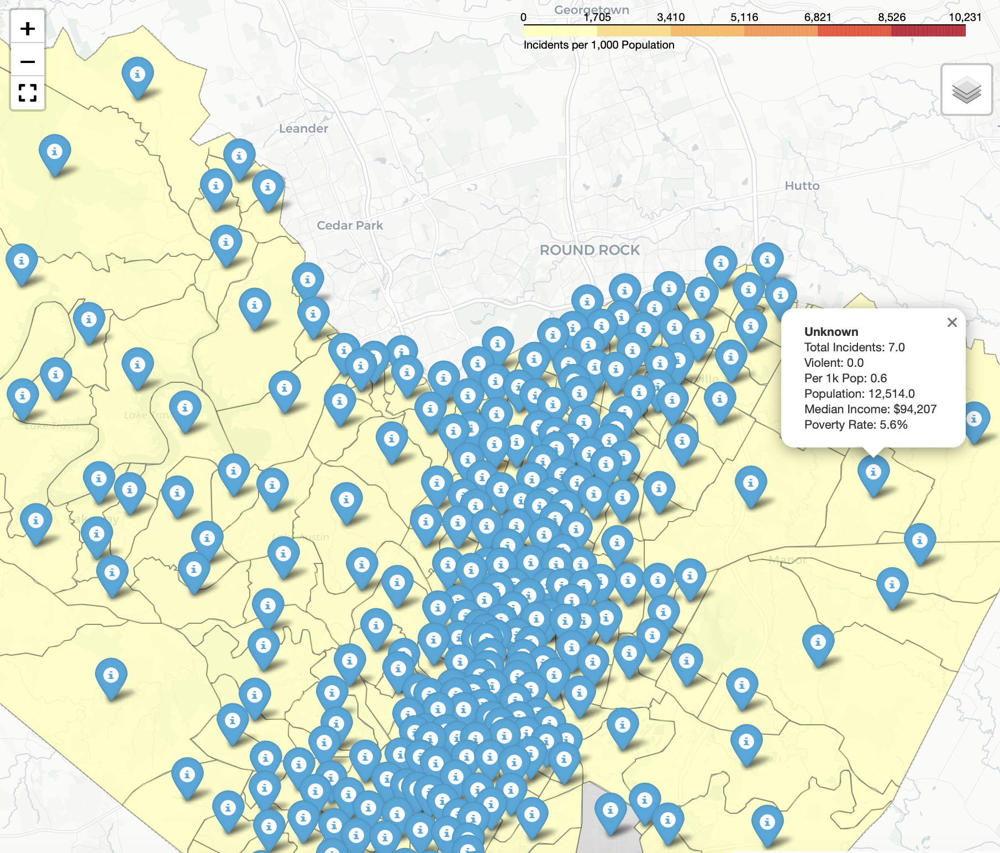
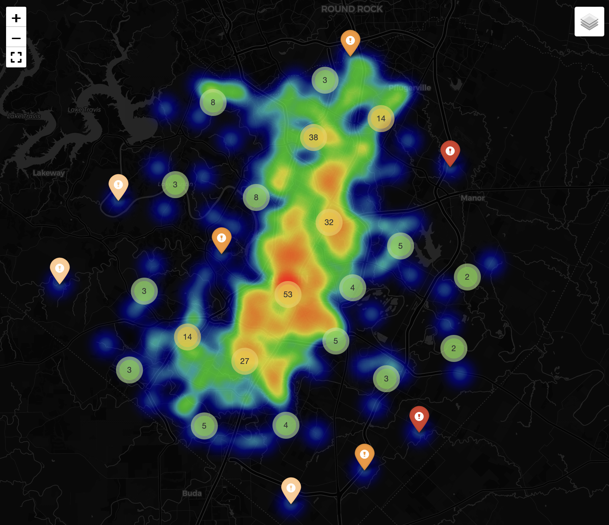

# Crime Grid

Austin public-safety data tooling. Two related projects live in this repo:

- **[RELAY](relay/)** — a live camera-to-camera **vehicle handoff tracker** (featured below).
- **[Austin Crime Ontology](#austin-crime-ontology)** — a crime-records analytics pipeline (further down).

---

## 🚗 RELAY — vehicle handoff tracker



**Open a live traffic camera, click a vehicle, and RELAY follows it down the road — re-identifying the same vehicle at the next camera and plotting its path across the network.**

It runs on real, public, geolocated cameras (City of Austin traffic cameras and
London TfL JamCams — switch cities from the top bar, no API key needed). A Python
computer-vision backend does the detection and re-identification; a browser
map UI shows the cameras, the live feeds, and the handoff.

### What it does

1. **Map of live cameras.** Click any camera to open its feed. The backend
   fetches the feed, runs **YOLO** vehicle detection, and overlays clickable
   boxes on the frame (with a looping "LIVE" view for video sources).
2. **Pick a target.** Click a vehicle. RELAY captures its **appearance
   embedding** (a re-ID feature vector) and colour signature.
3. **Arm the road ahead.** It computes the plausible **next cameras down the
   road** — nearest cameras in range, preferring those aligned with the source
   camera's facing direction — and starts scanning each one, with an
   arrival-time window derived from distance.
4. **Trigger on re-identification.** When a vehicle at an armed camera matches
   the target (cosine similarity over threshold) **within its arrival window**,
   RELAY fires a `MATCH`.
5. **Plot the path + keep following.** Each confirmed sighting is added to the
   car's **path** (numbered waypoints + line on the map, plus a journey timeline
   with per-hop time, distance, and similarity). RELAY then re-anchors to the
   matched vehicle and arms the *new* camera's downstream set, following it hop
   by hop across the camera network.

### Under the hood

- **Backend** (`relay/backend`): FastAPI + a single CV worker thread —
  Ultralytics **YOLO** detection, a **ResNet-50 appearance embedding** for
  cross-camera re-ID (pluggable with `torchreid`/OSNet), great-circle
  topology for "next camera down the road", and a WebSocket event stream.
- **Frontend** (`relay/frontend`): Vite + Leaflet — camera map, live feeds with
  detection boxes, the target/path/event panels, and a London/Austin toggle.

### Run it

```bash
cd relay
scripts/setup.sh      # Python venv + deps (incl. torch) + frontend deps
scripts/dev.sh        # backend :8000 + frontend :5173  → open http://localhost:5173
```

Full details, configuration, and the honest limitations (public feeds refresh
slowly, so live multi-hop depends on a vehicle actually passing an armed camera
during a refresh) are in **[`relay/README.md`](relay/README.md)**.

> **Note:** RELAY is a demonstration of multi-camera vehicle **re-identification**
> as a computer-vision problem, using only public, officially-published camera
> feeds under their terms. These are low-resolution traffic cameras not designed
> to identify individuals; don't use it to surveil or track people.

---

# Austin Crime Ontology
[in progress]

A local analytics pipeline that converts Austin PD crime records into an ontology-style data model in DuckDB, then generates trend outputs and maps.

## Overview
This project turns flat public-safety records into a connected object model so analysis can follow relationships across entities instead of scanning one denormalized table.

| Correlation Plot | Density Map | Hotspot Map |
|---|---|---|
|  |  |  |

## Ontology Design Summary
- Core objects: `Incident`, `Location`, `OffenseType`, `District`, `CensusTract`, `Demographics`
- Core links: incident-to-location, incident-to-offense, location-to-district, location-to-tract, and tract-to-demographics
- Modeling goal: preserve source traceability while enabling cross-domain questions (crime patterns by place, offense mix by district, and demographic context by tract)
- Pipeline scope: ingest data, build objects/links, run analytics, and export CSV + HTML outputs to `data/outputs/`

## Latest Run Results (March 14, 2026)
Run command:
```bash
python run_pipeline.py --skip-census
```

Observed outputs from this run:
- 500,000 incidents ingested (`2019-2024`)
- Yearly volume: 2019 `48,202`; 2020 `98,864`; 2021 `91,617`; 2022 `88,095`; 2023 `86,954`; 2024 `86,268`
- Violent incidents: `65,354` (13.1%); property incidents: `198,648` (39.7%)
- Pre/post-COVID shifts (2019 -> 2021):
  - UCR `23G`: `+460.5%` (483 -> 2,707)
  - UCR `240`: `+200.3%` (1,464 -> 4,397)
  - UCR `23F`: `+73.7%` (5,493 -> 9,541)
- Outputs generated: `q3_hotspots.csv`, `q5_yoy_trend.csv`, `q6_covid_comparison.csv`, `map_hotspots.html`, `map_covid_trend.html`

## Implications from this run
- Trend analysis is working: offense composition and year-over-year deltas are usable.
- Spatial and tract-level conclusions are not reliable yet in this run:
  - `link_location_tract` produced `0` links.
  - Location dedup collapsed to a single canonical location (all 500,000 incidents at one hotspot), which indicates geospatial input quality issues.
- Priority fix before policy conclusions: restore reliable point coordinates and tract linkage, then rerun the pipeline.

## Quickstart
```bash
python -m venv .venv
source .venv/bin/activate
pip install -r requirements.txt
cp .env.example .env
python run_pipeline.py
```

## Project Layout
- `ingestion/` data fetchers
- `ontology/` object + link builders
- `analysis/` analytical queries
- `viz/` map generation
- `sql/` schema definitions
- `run_pipeline.py` single entry point
- `relay/` the RELAY vehicle handoff tracker (see above)
